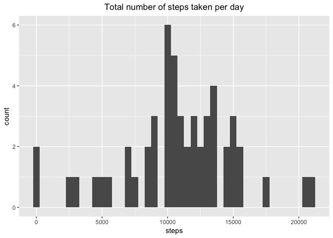
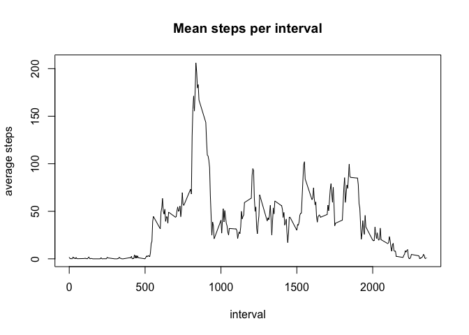
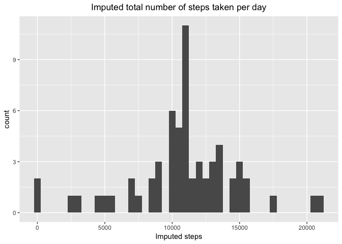
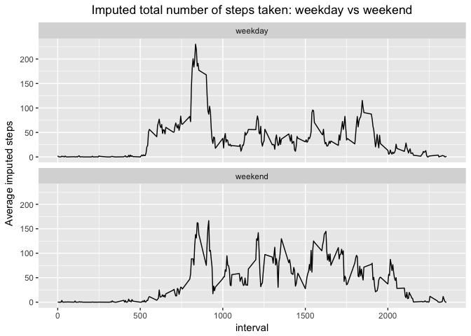

# Reproducible Research: Peer Assessment 1


## Loading and preprocessing the data


```r
fileurl <- "https://d396qusza40orc.cloudfront.net/repdata%2Fdata%2Factivity.zip"
download.file(fileurl, "PM_data.zip", method="curl")
#check contents of zip file
unzip("PM_data.zip", list=TRUE)
```

```
## Warning in strptime(x, format, tz = tz): unknown timezone 'zone/tz/2018e.
## 1.0/zoneinfo/America/New_York'
```

```
##           Name Length                Date
## 1 activity.csv 350829 2014-02-11 10:08:00
```

```r
activity <- read.table(unz("PM_data.zip", "activity.csv"), header=T, sep=",")
```

## What is mean total number of steps taken per day?


```r
total_steps <- activity %>%
  filter(!is.na(steps)) %>%
  group_by(date) %>%
  summarise_all(funs(sum))

ggplot(data=total_steps, aes(x=steps)) +geom_histogram(binwidth = 500) +
  ggtitle("Total number of steps taken per day") +
  theme(plot.title = element_text(hjust = 0.5))
```

<!-- -->

```r
summary <- total_steps %>%
  summarize(mean=mean(steps), median = median(steps))
```

The mean number of steps per day is 10766.19 and the median is 10765.

## What is the average daily activity pattern?


```r
time_series <- activity %>%
  filter(!is.na(steps)) %>%
  group_by(interval) %>%
  summarize(mean=mean(steps))

plot(mean ~ interval, data=time_series, type="l", xlab = "interval", ylab = "average steps", main = "Mean steps per interval")
```

<!-- -->


```r
max_interval <- time_series %>%
  summarise(max=max(mean))
tmp <- which(time_series$mean == max_interval$max)
max <- time_series[tmp, ]
max_time <- max$interval
```

The 5- minute interval that contains the maximum number of steps across all days in the dataset is 835.

## Imputing missing values


```r
missing <- sum(is.na(activity$steps))
```

There are 2304 rows with missing values in the dataset.


```r
#replace NAs with the average value for that time interval
activity$impute <- ifelse(is.na(activity$steps) == TRUE, time_series$mean[time_series$interval %in% activity$interval], activity$steps)  

impute_day <- activity %>%
  group_by(date) %>%
  summarise_all(funs(sum))

ggplot(data=impute_day, aes(x=impute)) +geom_histogram(binwidth = 500) +
  ggtitle("Imputed total number of steps taken per day") +
  theme(plot.title = element_text(hjust = 0.5)) +
  xlab("Imputed steps")
```

<!-- -->

```r
imp_summary <- impute_day %>%
  summarize(mean=mean(impute), median = median(impute))
```

The imputed mean value is 10766.19 and the imputed median value is 10766.19.  The impact of imputing missing data by replacing NAs with average values is to center the values more closely around the mean. 

## Are there differences in activity patterns between weekdays and weekends?


```r
activity$date <- ymd(activity$date)
activity$day <- weekdays(activity$date)
activity$day_type <- as.factor(ifelse(activity$day %in% c("Saturday","Sunday"), "weekend", "weekday"))
levels(activity$day_type)
```

```
## [1] "weekday" "weekend"
```

```r
toplot <- activity %>%
  group_by(interval, day_type) %>%
  summarise(mean=mean(impute))

ggplot(data = toplot, aes(x=interval, y=mean)) +geom_line() + 
  facet_wrap(~day_type, nrow = 2) + 
  ggtitle("Imputed total number of steps taken: weekday vs weekend") +
  theme(plot.title = element_text(hjust = 0.5)) +
  ylab("Average imputed steps")
```

<!-- -->
